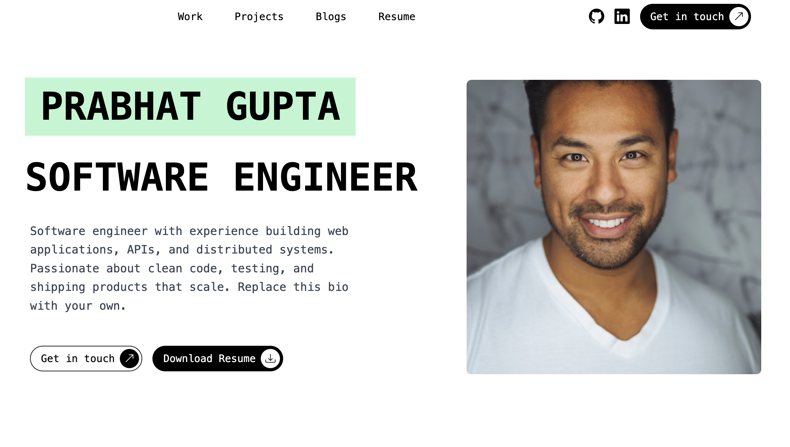
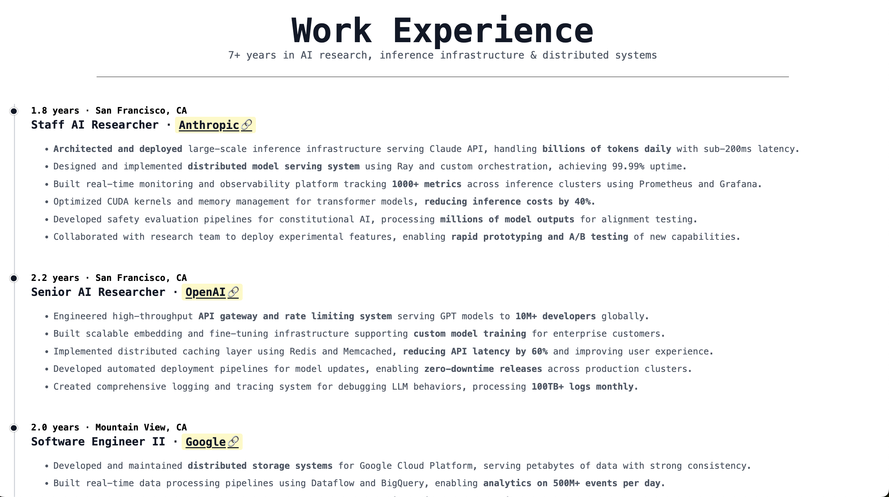
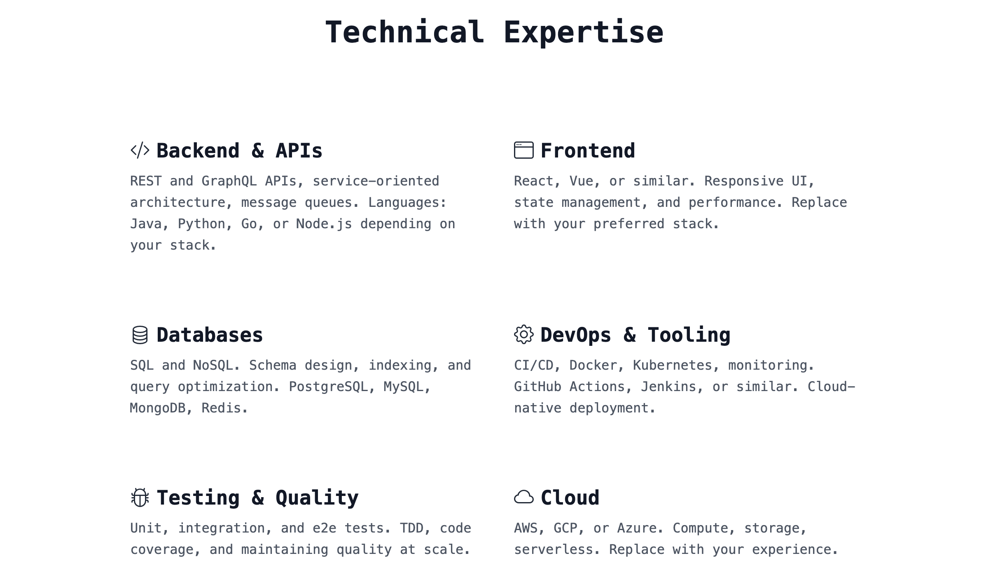
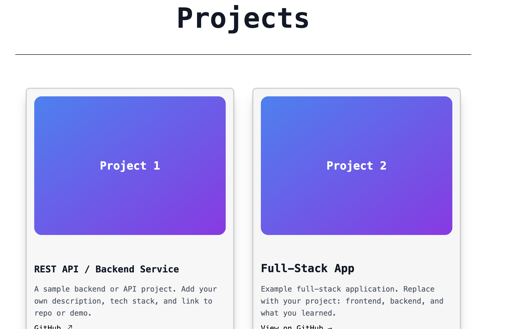

# Portfolio Template

A single-page portfolio template for software engineers. Responsive layout with an about section, work experience timeline, blog links, technical expertise grid, and project cards. Customize name, bio, links, and content in `index.html`.

## Quick start

Open `index.html` in a browser or serve the folder with any static server. No build step required.

## What’s included

- **About** — Name, title, short bio, photo placeholder, CTA buttons (contact, resume).
- **Work experience** — Vertical timeline with company, role, duration, and bullet points.
- **Blogs** — List of blog posts with titles, excerpts, and links to `blog/` pages.
- **Technical expertise** — Grid of skills (e.g. Backend, Frontend, Databases, DevOps, Testing, Cloud).
- **Projects** — Card grid for projects and blog previews with optional GitHub links.
- **Resume** — Optional LaTeX resume in `PKG_Resume_Template/`; main page links to a PDF (replace with your own).

Replace placeholder text, profile image (`assets/images/people/dp.png`), and social/contact links with your own. Update meta tags and Open Graph in `<head>` for sharing.

## Preview (section by section)

Screenshots below follow the page from top to bottom.

**1. About — name, title, bio, and CTAs**



**2. Work experience timeline**



**3. Blogs section**


**4. Technical expertise grid**



**5. Projects section**



## Structure

```
portfolio-template/
├── index.html          # Main page
├── index.js            # Animations (e.g. GSAP)
├── blog/               # Sample blog posts
├── css/                # Styles (Tailwind, custom)
├── assets/
│   └── images/
│       ├── home/       # Screenshots for README
│       └── people/     # Profile photo (dp.png)
└── PKG_Resume_Template/  # Optional LaTeX resume
```

## Tech

- Plain HTML, CSS (Tailwind-style utility classes), minimal JS.
- GSAP + ScrollTrigger for scroll-based animations.
- Bootstrap Icons for icons.

## License

    Copyright 2025 Prabhat Gupta

    Licensed under the Apache License, Version 2.0 (the "License");
    you may not use this file except in compliance with the License.
    You may obtain a copy of the License at

       http://www.apache.org/licenses/LICENSE-2.0

    Unless required by applicable law or agreed to in writing, software
    distributed under the License is distributed on an "AS IS" BASIS,
    WITHOUT WARRANTIES OR CONDITIONS OF ANY KIND, either express or implied.
    See the License for the specific language governing permissions and
    limitations under the License.

---

If this template helped you, please 🌟 [star the repository](https://github.com/prabhatkgupta/pkg_portfolio_template) on GitHub and share it with friends who might find it useful.
